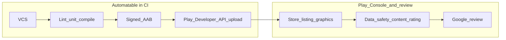

# Android to Google Play pipeline plan

**Purpose:** Single link target for the full investigation and checklist: **vertex-play** (this repo) plus **vertex-studio** lab infra (Jenkins, Docker registry).

### Tracking this work

- **Checklist lives here.** The phases and IDs below (P, I, II, III, IV, V, A–D, F—about **74** rows in the granular index) are enough for day-to-day progress. Reference IDs in commits, PRs, or chat (e.g. “closes scope for **A-06**”).
- **Optional board (light mirror only).** If you want issues/epics in **Taiga**, GitHub, Jira, or similar: create **a handful of epics**, not one ticket per row. Practical splits: **one epic per phase** (e.g. “Phase II — Play API”) and/or **one per POC** (A–D). Each epic description should **link to this file** (`docs/android-play-pipeline-plan.md` on the default branch). Put detail in the doc; use the tracker for **status and blocking**, not a full duplicate list.
- **Taiga on the lab.** Vertex-studio deploys [Taiga](../vertex-studio/docs/playbooks/taiga.md)—a natural place for those epics. Add stories manually, or use **Taiga’s REST API** if you automate imports later. **Do not** bulk-write Taiga’s **database** directly (upgrades and schema changes break ad-hoc SQL; notifications and permissions won’t match).
- **What not to do:** Mass-create ~74 issues; raw DB dumps into any tracker. The doc **will** change—keep the file and any tracker epics in sync when you revise scope (see **Living document** below).

**Editor note:** A copy may also exist under `.cursor/plans/` locally; use **`docs/android-play-pipeline-plan.md`** on the default branch when sharing URLs.

**Living document:** Early-stage draft. The checklist and design will shift as you run POCs, enroll in Play, and add a real Gradle project. Treat Play policies, signing, and tax/regulatory steps as **authoritative from Google / your advisers**, not from this file. Anything produced in pairing (including by an assistant) can be wrong or outdated—**verify** before you rely on it.

---

## Current state (verified in repo)

- **[vertex-studio](../vertex-studio)** is Ansible-deployed services on a lab host; **Jenkins** runs in Docker with the **host Docker socket** mounted (`[roles/jenkins/templates/docker-compose.yaml.j2](../vertex-studio/roles/jenkins/templates/docker-compose.yaml.j2)`), and the root `[Jenkinsfile](../vertex-studio/Jenkinsfile)` shows tag-triggered `docker build` / `docker push` to `shadowlands:5000`.
- **Private registry** is optional (`make registry`); [docker-registry-investigation.md](../vertex-studio/docs/design/docker-registry-investigation.md) documents HTTP registry, `insecure-registries`, and Docker 29 / containerd snapshotter caveats—relevant if you **cache a custom Android build image** in that registry.
- **No Android, Gradle, or Play-related** references exist under `vertex-studio` today; the design is greenfield relative to that repo.
- **This repo** (`vertex-play`) is the **Android / Play pipeline** home (scaffold `README.md` + `LICENSE` as of plan update); **no Gradle project yet**—Phase I / POC-A still need an app module or checked-in sample.

This plan treats “full blown pipeline **up to** Play submission” as: **reproducible CI that produces a policy-valid release bundle and can deliver it to a Play track**, plus an explicit **human/console checklist** for verification and listing (policies, assets, questionnaires)—because Google does not fully automate “placement on the store” without console steps and review.

### Ownership: git and platform operations (you, not the plan executor)

The checklist below is still **your** work to track. In normal pairing, **no git operations** (new repos, branches, remotes, `jenkins_repos` edits, commits), **no GitHub webhook or PAT changes**, and **no Ansible vault edits** are implied unless you explicitly ask for drafted files or commands and run them yourself.

**Operator-owned (typical):**

- GitHub: repo creation, permissions, webhooks, PAT scopes, adding the app repo to `jenkins_repos` in [vertex-studio inventory](../vertex-studio/inventory/group_vars/all/vars.yaml), redeploy Jenkins (`make jenkins`), multibranch job visibility in Jenkins UI.
- Secrets: creating Jenkins credentials (keystore, Play service account JSON), vault password handling, keystore backup storage.
- Google: Play Console app creation, GCP linking, service account keys, IAM in Console, store listing and policy forms.

**Pairing / implementation can still help with:** Dockerfile and `Jenkinsfile` content, Gradle signing patterns (without secrets), lab notes under `docs/design/`, and concrete file diffs you choose to apply and commit.

Phase **P** todos remain **naming and documentation decisions** you make when you touch git or the vertex-studio README; they are not a request for someone else to create repos for you.

### Recorded context (clarified with B)

- **App repo:** **this repository** — created; contents are still scaffold (no Gradle tree yet). **Phase I** / **POC-A** proceed by **adding** a minimal Android project in-repo or documenting an external sample path; refresh **I-01–I-09** and **I-09** once `app` + `build.gradle.kts` (or Groovy) land.
- **Play Console:** Not enrolled yet — **Phase II** starts with **developer program signup** (account requirements, one-time registration fee, acceptance into Play Console) before **GCP linking** and the Developer API. Add **II-00** (enrollment complete, Console reachable) as a gate before **II-03**.
- **P-01:** Done — scope recorded in [scope.md](scope.md) (single repo for app + CI + builder image + docs; `vertex-play-ci` deferred).
- **P-02:** Done — Git/lab boundaries in [repo-boundaries.md](repo-boundaries.md).
- **Repo working name:** `**vertex-play`** — Android app + Google Play pipeline.
- **Australia:** Enrollment and **identity verification** depend on **Personal vs Organization** in Play Console and on Google’s **country-specific document list**—not a single “ABN required” rule for everyone. **Organization** accounts typically need **business registration** evidence (and Google often asks for a **D-U-N-S** number for orgs); Australian companies usually have **ASIC / ABN-related paperwork** in that picture, but the authoritative list is Google’s page for Australia, not this plan. **Personal** developer accounts commonly use **personal ID** (and possibly proof of address) without trading as a registered business. **ABN / GST** for **tax or merchant-of-record** reasons when selling paid products is separate from “can I open a dev account”; confirm with a **qualified tax adviser** if you are unsure. Official starting point: [Google Play Developer Verification — documents by country/region](https://support.google.com/googleplay/android-developer/answer/15633622) (select **Australia**).

### Granular task index (todo IDs)

The plan todo list has **74** checkable items; prefix encodes phase:

- **P-01 … P-03** — Repo / product boundaries (`vertex-play` naming) (3)
- **I-01 … I-09** — App baseline / build contract (9)
- **II-00, II-00a, II-01 … II-09** — Play enrollment (incl. Australia verification checklist) + GCP + service account (11)
- **III-01 … III-07** — Signing model + Jenkins wiring (7)
- **IV-01 … IV-08** — Policy, listing, submission readiness (8)
- **V-01 … V-06** — Lab capacity + Docker/registry + emulator decision (6)
- **A-01 … A-09** — POC-A Docker toolchain + `bundleRelease` (9)
- **B-01 … B-06** — POC-B CI signing + verify AAB (6)
- **C-01 … C-06** — POC-C upload tool + internal track (6)
- **D-01 … D-04** — POC-D instrumented tests, optional (4)
- **F-01 … F-05** — Final architecture + spec + risks + doc index (5)

Suggested order: **V** and **POC-A** can start once **vertex-play** has (or references) a buildable Android tree; **II-00** (Play enrollment) in parallel. **I** tracks **vertex-play** as **I-01** path is known; rerun **I** if project layout changes. **II-01+** after **II-00**, **III**, **IV** in parallel where possible, **A → B → C**, **D** if needed, **F** last. **P-02–P-03** when you document boundaries and update [vertex-studio README](../vertex-studio/README.md) Vertex apps table / link.

---

## What “Play Store submission” actually consists of (two halves)

- **CI/CD half**: produce a **release Android App Bundle (AAB)** (standard for new apps on Google Play; see [Android App Bundle](https://developer.android.com/guide/app-bundle)), **sign** it appropriately for your Play App Signing setup, and **upload** to a track (typically **internal testing** first) via **Google Play Developer API** (often wrapped by **Gradle Play Publisher**, **fastlane supply**, or custom scripts). This is what Jenkins + secrets + tooling can own end-to-end.
- **Console / policy half**: create the app in Play Console, complete **store listing**, **Data safety**, **content rating**, **target API level** compliance, **privacy policy** URL if required, **testers**, etc. Then **Google verification/review**—timeline and outcome are not controllable from Jenkins. The plan should document this as a **parallel workstream** with acceptance criteria, not as a single pipeline stage.

---

## Technical building blocks (inventory to validate, not assume)

| Area              | What must be true                                                                                  | Why it matters for your lab                                                               |
| ----------------- | -------------------------------------------------------------------------------------------------- | ----------------------------------------------------------------------------------------- |
| **JDK**           | Version compatible with your **Android Gradle Plugin (AGP)**                                       | Wrong JDK breaks Kotlin/Gradle; pin in Docker image or toolchains                         |
| **Android SDK**   | `cmdline-tools`, platforms, build-tools, (optional) **NDK**                                        | CI must install or bake these; license acceptance is required for unattended installs     |
| **Gradle**        | Prefer **Gradle Wrapper** in the app repo                                                          | Reproducible builds; Jenkins calls `./gradlew`                                            |
| **Outputs**       | **Release AAB** for Play; debug APK/AAB optional for artifacts                                     | Play upload path targets AAB + versionCode rules                                          |
| **Signing**       | **Upload key** (and Play App Signing enrollment)                                                   | Keystore/passwords are secrets—Jenkins credentials or external secret store; never in git |
| **Versioning**    | **versionCode** monotonic per package name                                                         | CI must bump or derive (tags, pipeline params) or uploads fail                            |
| **Play API auth** | **Google Cloud** project linked to Play Console; **service account** with Play Console permissions | JSON key is a high-value secret                                                           |
| **Quality gates** | Lint, unit tests, (optional) UI/instrumented, SAST                                                 | Scope drives agent hardware and job time                                                  |

Nothing in the list above should be “assumed correct”—each row is a **design decision + verification** item (see POCs below).

---

## Major design forks (choose explicitly during investigation)

These change architecture cost and feasibility on a home lab:

1. **Where the Android toolchain runs**
  - **A. Dockerized build** (Jenkins runs `docker build` / `docker run` with an image that contains SDK + pinned JDK): aligns with your existing socket-based Jenkins; image can be stored in `**shadowlands:5000`** after POC.
  - **B. SDK installed on lab host**: simpler for one-off experiments, worse for reproducibility and upgrades.
2. **Instrumented / UI tests in CI**
  - **None (initial)**: only JVM unit tests + lint + assemble—lowest friction.
  - **Emulator on lab**: needs **KVM**/CPU features, RAM, and stable headless emulator images; often painful on heterogeneous hardware.
  - **External farm** (e.g. Firebase Test Lab, proprietary device clouds): extra accounts, cost, network egress from Jenkins—document egress from Tailscale lab to Google APIs.
3. **Upload automation**
  - **Gradle Play Publisher** vs **fastlane** vs **raw API**: pick based on team familiarity and whether the app is single-module or complex flavor/matrix.
4. **Branch / promotion model**
  - e.g. PR builds → debug; `main` → internal track; tagged release → closed/production—must match your Play track strategy and signing keys.

---

## Integration with vertex-studio specifically

- **Jenkins**: Multibranch + `Jenkinsfile` in the **app repository** (same pattern as [docs/playbooks/jenkins.md](../vertex-studio/docs/playbooks/jenkins.md)); Android jobs will differ from the vertex-studio image pipeline—**this repo (`vertex-play`)** is the intended home once `Jenkinsfile` is added and the repo is listed in `jenkins_repos`.
- **Registry**: Use it to host `**jenkins-android-agent:tag`** (or build cache image) so rebuilds are fast and documented; not a substitute for Play distribution.
- **Secrets**: Today, sensitive values live in **Ansible Vault** for deploy-time config; **Play service account JSON** and **keystore** are **Jenkins credentials** (or a small, audited secret mechanism you add). The plan should spell out **rotation**, **backup of upload keystore**, and **who can decrypt**.
- **Network**: Webhooks already use Tailscale Funnel in docs; Play API and SDK downloads require **outbound HTTPS** from the build environment—confirm from the lab host.

### Does this become a project like `vertex-play`?

**Not automatically**—you split concerns into what the **lab platform** owns vs what the **Android / Play product** owns. [vertex-studio](../vertex-studio) stays the Ansible home for Jenkins, registry, and docs site; it does not need to contain your app source.

A repo named `**vertex-play`** is the **working name** here: it signals **Google Play** delivery as well as the Android app. In **P-01**, define what it contains:

1. **Lab-tooling / CI kit only** — Dockerfile(s) for the Android SDK build image, optional shared `Jenkinsfile` fragments or README for wiring `jenkins_repos`, and design notes. **No** store listing tied to this repo unless you also keep a throwaway sample app here for POCs.
2. **The actual shipped app** — Full Gradle project, `Jenkinsfile`, signing/play config as code; `**vertex-play`** is then the **product** repo (like **vertex-block** in the roadmap). Play Console and store listing refer to this application.
3. **Hybrid** — Same repo holds both a `samples/hello` module for lab smoke tests **and** the real app; higher coupling; only worth it if you want one clone for everything.

**Typical clean split:** **vertex-studio** (infra) + `**vertex-play`** (or your chosen app repo name) + optionally a small `**vertex-play-ci`** repo if you want CI Dockerfiles separate from app code so image rebuilds do not churn the app’s git history.

**P-01–P-03** capture the final naming and documentation outcome; rename the string if you change your mind later.

**When to decide P:** You do **not** need to finalize P before investigation. **I-01** (where the app repo lives) is enough to start **I**, **V**, and **POC-A**. Treat **P-01–P-02** as blocking only when you are about to **create a new repo**, **split CI Dockerfiles out of the app repo**, or **commit to a name** for docs and `jenkins_repos`. **P-03** waits until that naming is stable.

---

## Investigation phases (each produces written evidence)

**Phase I — App baseline (input from the real project)**

- Capture: min/target/compile SDK, AGP version, Kotlin version, product flavors, modules, presence of native code (NDK), and existing Gradle tasks (`bundleRelease`, `lint`, `test`).
- Outcome: a one-page **build contract** (commands that must succeed in CI).
- **Repo note:** Use a **minimal in-repo sample** or external template until `vertex-play` has a full app; **re-run Phase I** when modules/flavors change materially.

**Phase II — Google Play account and API**

- **First:** **II-00** — developer program enrollment and Console access (prerequisite if not yet enrolled). **II-00a** if in **Australia** — align account type and documents with Google’s AU list (ABN is not assumed for every signup; see **Recorded context**).
- Then confirm: organization access, ability to create/link **Google Cloud** project, enable **Google Play Android Developer API**, create **service account**, grant **Play Console** permissions (minimum for uploads to internal testing).
- Outcome: checklist with screenshots or internal notes (no secrets in repo)—and a test project/app for dry-run uploads.

**Phase III — Signing model**

- Confirm **Play App Signing** status for the app; locate **upload certificate** requirements.
- Outcome: documented **where** the upload keystore lives, **how** CI references it, and disaster recovery if keystore is lost (Google-held signing key vs upload key rotation process).

**Phase IV — Policy and listing readiness**

- Map app to: **Data safety form**, **target API policy**, **permissions justification**, **deletion/account requirements** if applicable.
- Outcome: **go/no-go** list before first production submission—this is what “verification” usually blocks on, not Gradle.

**Phase V — Lab capacity**

- Measure: disk for SDK images and Gradle caches, RAM for parallel jobs, CPU for compilation, feasibility of emulator if you want it.
- Cross-check Docker host notes in [docker-registry-investigation.md](../vertex-studio/docs/design/docker-registry-investigation.md) for **Docker 29 / insecure registry** behavior when pushing/pulling builder images.

---

## POC sequence (recommended order)

1. **POC-A — Headless `bundleRelease` in Docker**: Dockerfile with JDK + SDK + accepted licenses; run `./gradlew :app:bundleRelease` for a **minimal sample app** or your real app in a branch. Proves toolchain and reproducibility on the lab.
2. **POC-B — Signing**: Configure signing config wired from **environment/credentials** (not committed); verify `jarsigner` / Play’s signing requirements on the produced AAB.
3. **POC-C — Internal track upload**: Using a **throwaway** Play app, upload the AAB with chosen tool (GPP/fastlane/API); confirm versionCode handling and track visibility.
4. **POC-D (optional) — Instrumented tests**: Only if Phase IV demands it; spike emulator or external lab from Jenkins and record stability and duration.

Each POC should end with a short **lab note** under `docs/design/` (you can adopt the tone of the existing registry investigation doc)—what worked, exact versions, and failures.

---

## Deliverables when “design is fully fleshed out”

1. **Target architecture diagram** (repos, Jenkins, registry image, secrets flow, Play API).
2. **Stage definitions** for the `Jenkinsfile` (or shared library) with explicit inputs/outputs per stage.
3. **Secret inventory** (keystore, Play JSON, any API keys) with storage location and rotation owners.
4. **Play Console checklist** (manual) aligned with your app category.
5. **Risk register**: e.g. emulator omitted, single-machine Jenkins SPOF, review rejection paths.

---

## What this plan explicitly does not decide yet

- Final scope of a dedicated `**vertex-play`** repo (**lab CI tooling**, **product app**, or **hybrid**)—see **Phase P** todos (name can still change).
- Single-app vs monorepo, Kotlin Multiplatform, or Flutter/React Native (each changes Gradle/plugins and CI).
- Whether instrumented tests are in scope for v1.
- Whether you require **compliance scanning** (SBOM, dependency policies) as gates.

Those should be resolved during **Phase P**, Phase I, and the POC gates—not assumed at planning time.