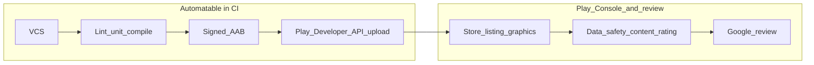

Part of the hub [android-play-pipeline-plan.md](android-play-pipeline-plan.md). Task IDs and **Done** status live there.

---

## What “Play Store submission” actually consists of (two halves)

- **CI/CD half**: produce a **release Android App Bundle (AAB)** (standard for new apps on Google Play; see [Android App Bundle](https://developer.android.com/guide/app-bundle)), **sign** it appropriately for your Play App Signing setup, and **upload** to a track (typically **internal testing** first) via **Google Play Developer API** (often wrapped by **Gradle Play Publisher**, **fastlane supply**, or custom scripts). This is what Jenkins + secrets + tooling can own end-to-end.
- **Console / policy half**: create the app in Play Console, complete **store listing**, **Data safety**, **content rating**, **target API level** compliance, **privacy policy** URL if required, **testers**, etc. Then **Google verification/review**—timeline and outcome are not controllable from Jenkins. The plan should document this as a **parallel workstream** with acceptance criteria, not as a single pipeline stage.
